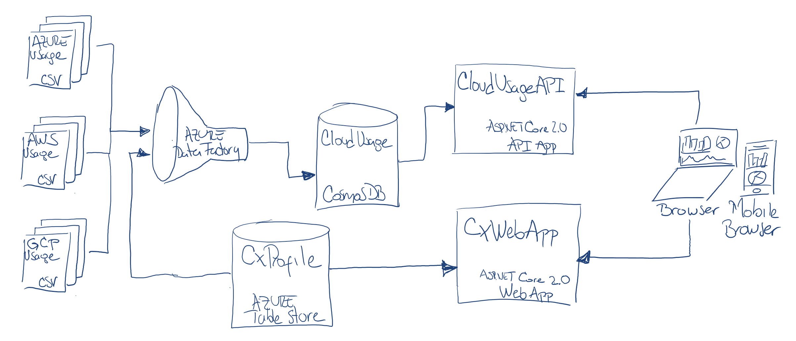

# SSGG Cloud Usage Analytics Portal

The present project encompases all relevant projects to provide a full solution from data gathering to data visualization, of all usage and consumption data from the different cloud providers, for customers paying for Managed Services (SSGG) to InnovaDAG.

## Architecture
The project general architecture can be seen in the following diagram.

